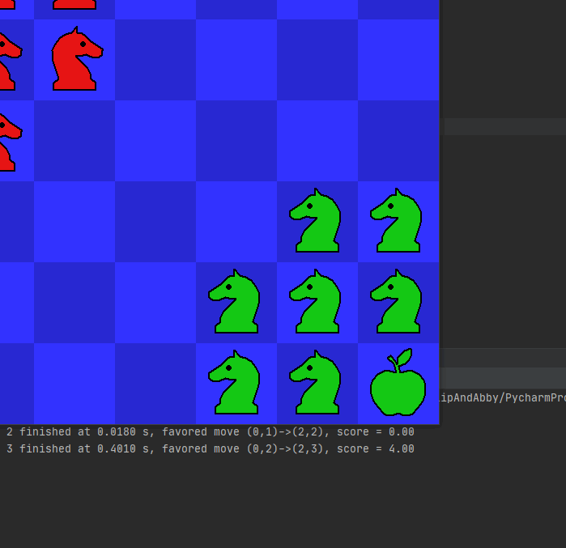

# Monte-Carlo-Hold-Your-Horses
A Monte Carlo Search Tree utilizing Rapid Action Value Estimation to play the game Hold Your Horses.

Parallel Rave (ParallelRave.py) is generally the strongest implementation and has the highest winrate.

In circumstances where concurrency is not allowed, HoldHorsesZeroV2/HoldHorsesRave are the strongest. 

This won 1st place in the annual AI/ML game playing algorithms tournament at University of Massachusetts Boston.

Example game:

